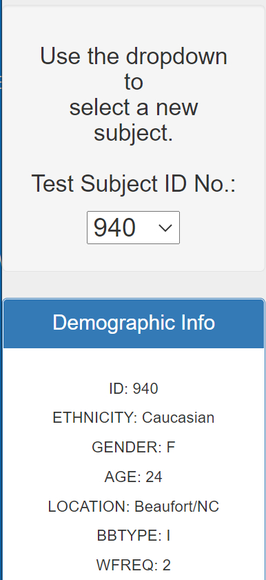
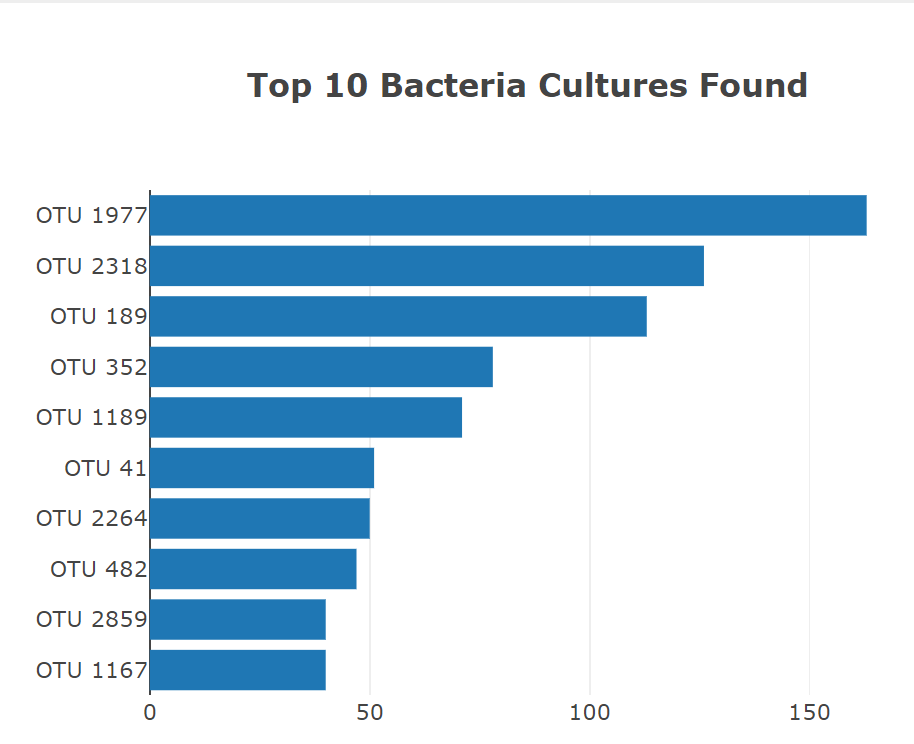
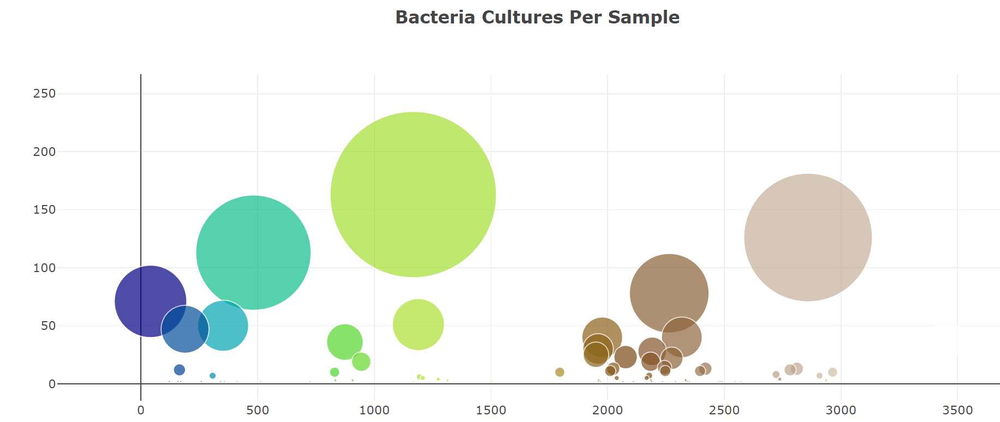
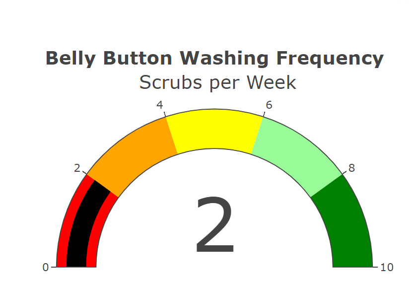

# Belly_Button_Biodiversity

# Module 12 Challenge

# Purpose
Complete a dashboard to display bacterial data that synthesize proteins for the
volunteer data. The demographic data for each volunteer has been provided. The
pre-loaded volunteer is ID 940 and the data reflected in a bar chart, bubble
chart and gauge chart.. When selecting another ID from the dropdown, each
chart reflects data specific to that ID.

